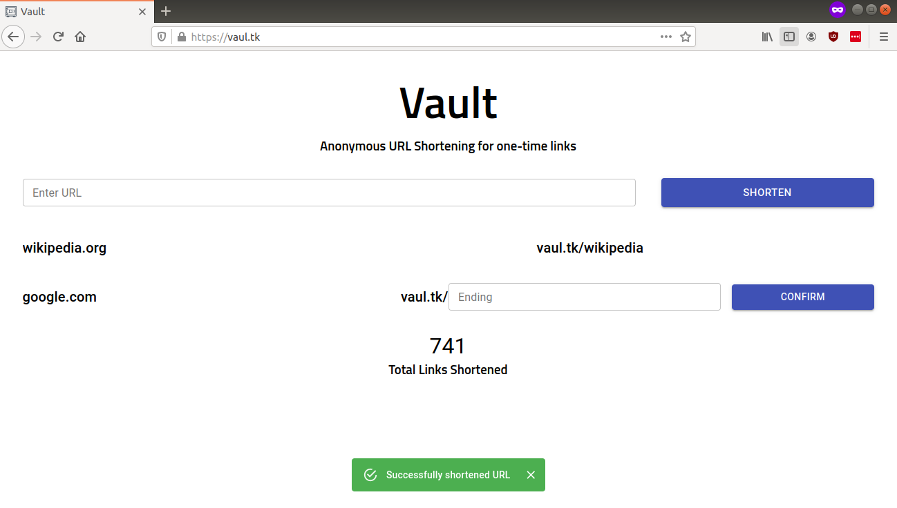

# VaultK

Vaultk is a URL Shortening web application where the link shortened can only be accessed once.

## Details

Once the user creates the shortened link, the first person who clicks on the link is redirected to the original URL.

This project was developed using the MERN Stack, with the server deployed on Heroku and client on Netlify with API calls to the server.
